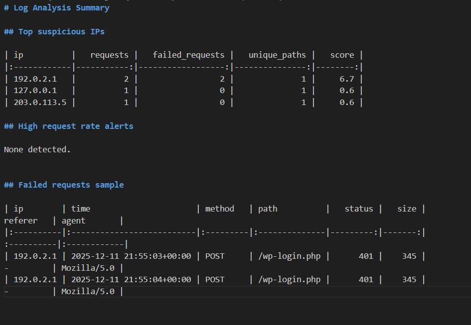

# 🔍 Log Analyzer for Suspicious Activity  
A beginner-friendly cybersecurity tool that parses web server logs (Apache format) to detect suspicious behavior such as:

- 🚫 Failed login attempts  
- 🔥 High request rates (brute-force behavior)  
- 🕵️ Suspicious endpoint access  
- 📊 IP scoring based on activity  

This tool outputs CSV files and a clean Markdown summary report that you can use for investigations or incident analysis.

---

## 📁 Features

### ✔ Failed Request Detection
Flags HTTP status codes that commonly indicate failed logins or probing (401, 403, 500).

### ✔ High Request Rate Detection
Identifies IPs making many requests in a short time (default: 20 requests per 60 seconds).

### ✔ Suspicious URL Detection
Detects paths commonly scanned during attacks:
- `/wp-login.php`
- `/xmlrpc.php`
- `/phpmyadmin`
- `.env`
- `/login`

### ✔ IP Reputation Scoring
Assigns a score to each IP based on:
- Number of failed requests  
- Total requests  
- Number of unique paths accessed  

---
## 📊 Example Report Output

## 📂 Project Structure

log-analyzer/
├── analyzer/
│ ├── parser.py
│ ├── detectors.py
│ └── reporter.py
├── data/
│ └── example_access.log
├── reports/
│ └── (generated automatically)
├── run_analyzer.py
└── README.md